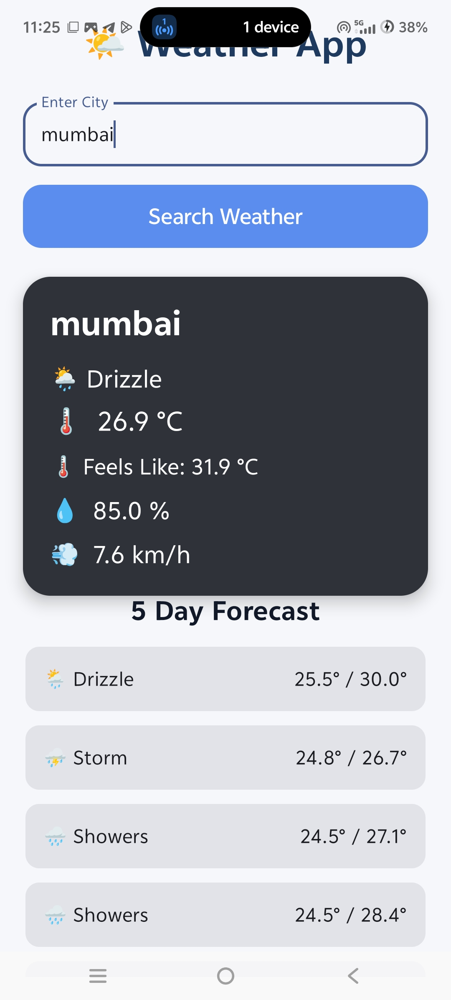
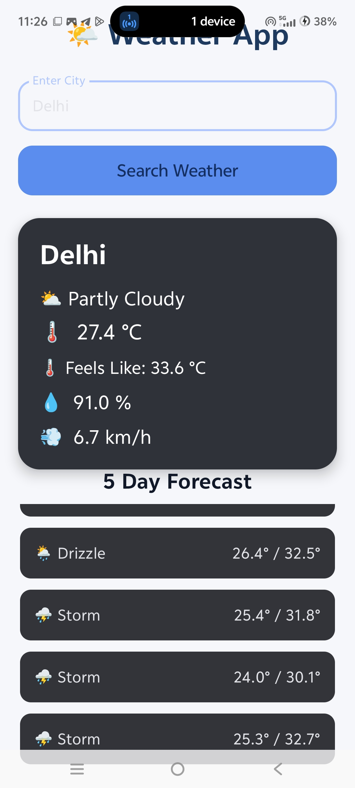

# 🌤 Weather App

A simple and professional Weather App built using Kotlin and Jetpack Compose.

## ✨ Features

- 🔍 Search weather by city
- 🌡️ Current temperature
- 🌡️ Feels Like temperature
- 💧 Humidity
- 💨 Wind speed
- ☀️ Weather condition
- 📅 5-day weather forecast
- ⏳ Loading indicator
- ⚠️ Error message for invalid cities
- 📱 Custom weather app icon

## 🛠️ Technologies Used

- Kotlin
- Jetpack Compose
- Retrofit
- Gson
- Open-Meteo Weather API
- Open-Meteo Geocoding API
- ViewModel
- Coroutines

## 📌 About

This project was created to practice Android development, API integration, Jetpack Compose UI, and MVVM architecture.

## 👩‍💻 Developer

Nancy Gupta

## Screenshot 

### Weather App

